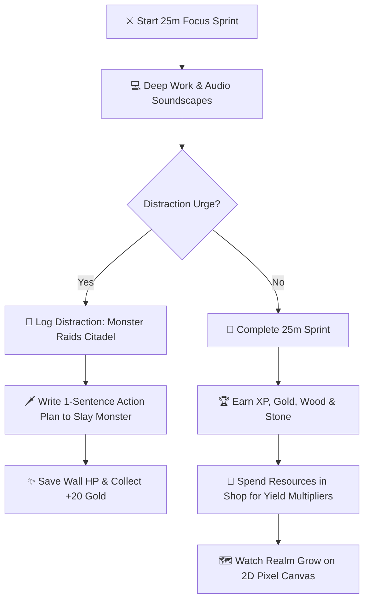

# Focus Quest ⚔️🏰

[](https://react.dev/)
[](https://vite.dev/)
[](https://tailwindcss.com/)
[](#-procedural-web-audio-soundscapes)

> **Gamified Deep-Work RPG Productivity App based on the Pomodoro Principle.**

**Focus Quest** transforms standard Pomodoro focus sessions into an interactive pixel-art RPG quest. Complete focus sprints, earn resources (Gold, Wood, Stone & XP), construct kingdom structures with passive yield multipliers, and defend your Citadel against rapid distraction monster raids in real-time!

---

## 📖 Table of Contents

- [✨ Key Features](#-key-features)
- [🎮 Core Game Loop](#-core-game-loop)
- [🤖 Built with Antigravity AI](#-built-with-antigravity-ai)
- [🏗️ Project Structure](#%EF%B8%8F-project-structure)
- [⚡ Tech Stack](#-tech-stack)
- [🚀 Local Installation & Quick Start](#-local-installation--quick-start)

---

## ✨ Key Features

### ⚔️ 1. Pomodoro Sprint Engine & RPG Economy
- **Flexible Sprint Modes:** Work (25m), Short Rest (5m), Long Rest (15m), plus fully customizable durations.
- **Circular SVG Progress Ring:** Smooth real-time percentage progress with glowing status indicators.
- **Resource Yields:** Completing a 25-minute focus sprint awards **XP, Gold, Wood, and Stone**.
- **Hero Leveling:** Level up your hero from *Apprentice Knight* to higher ranks with progress bars and daily streak counters.

### 🚨 2. Rapid Monster Raids & Citadel Wall HP
- **Real-Time Threat:** Logging a distraction spawns an attacking monster (**Distraction Beast 👹**) on the 2D map.
- **Rapid Wall Degradation:** Active monster raids degrade Citadel Wall HP **(-5 HP every 1.5 seconds)** with screen shake and fireball attack animations.
- **Battle & Defend Modal:** Write a 1-sentence action plan (*"Noted email idea, back to task"*) to slay the monster, stop wall damage, restore **+20 Wall HP**, and collect **+20 Bonus Gold**.
- **Citadel Repairs:** Spend Stone in the Monster Log to repair damaged Citadel walls.

### 🔨 3. Kingdom Building Shop & Yield Multipliers
Construct and upgrade 5 distinct structures with exponential cost scaling ($1.6^x$):
- 🪵 **Lumber Mill:** Boosts Wood yield (+25% per tier)
- 🪨 **Stone Quarry:** Boosts Stone yield (+25% per tier)
- ⚔️ **Knight Barracks:** Boosts Hero XP yield (+20% per tier)
- 🧙‍♂️ **Wizard Tower:** Boosts Gold yield (+30% per tier)
- 🏰 **Grand Citadel:** Boosts ALL resource & XP yields (+50% per tier)

### 🎵 4. Procedural Web Audio Soundscape Engine
**100% Client-Side Synthesized Audio** (Zero external MP3 dependencies):
- 🌧️ **Rain & Thunder:** Pink noise generator with dynamic low-pass filters.
- ☕ **Cozy Tavern:** Multi-frequency chatter rumble and glass clink resonance.
- 🌌 **Synthwave Focus Drone:** Detuned analog saw oscillators with slow LFO filter sweeps.
- 🧠 **Binaural Alpha Waves:** 432 Hz carrier with a 10 Hz binaural beat for deep focus.
- **8-Bit Sound FX (`sfx.js`):** Web Audio synthesized click sounds, quest start chimes, monster attack roars, and victory fanfares.

### 🗺️ 5. Interactive 2D Pixel Canvas Map
- **60 FPS Animation:** HTML5 2D Canvas rendering terrain tiles, flowing river water ripples, stone bridges, constructed buildings, and a patrolling Hero Knight.
- **Daylight Cycles:** Toggle between **☀️ Day**, **🌅 Sunset**, and **🌙 Night** (with ambient torch glow).
- **Weather Particles:** Toggle **Rain Storm**, **Magic Sparkles**, or **Clear Sky**.
- **Glassmorphic Raid View:** Semi-transparent battle modal allows viewing background fireball attacks on the Citadel while typing action plans.

### 🏆 6. Quest Trophies & Focus Analytics
- **Trophies Panel:** Unlock badges (*Novice Adventurer*, *Master Architect*, *Distraction Slayer*, *Deep Focus Legend*, *Fortress Defender*) for bonus resource rewards.
- **Focus Analytics:** Track total focus hours, sprint counts, **Focus Purity Score %**, and a 7-day productivity heatmap.

---

## 🎮 Core Game Loop



---

## 🤖 Built with Antigravity AI

Focus Quest was created by pairing step-by-step with **Google Antigravity AI**. Antigravity handled the technical setup—writing procedural Web Audio synthesis algorithms, coding 60 FPS HTML5 Canvas 2D math, setting up Tailwind styling, and managing React state persistence.

---

## 🏗️ Project Structure

```text
focus-quest/
├── public/
│   └── favicon.svg             # Quest icon favicon
├── src/
│   ├── assets/                 # App graphics & SVGs
│   ├── components/
│   │   ├── AchievementsPanel.jsx # Trophy rewards & quest achievement system
│   │   ├── BuildingShop.jsx     # Structure shop with resource deductions & tiers
│   │   ├── DistractionLog.jsx   # Defeated monster logs & Citadel Wall repairs
│   │   ├── FocusAnalytics.jsx   # Productivity heatmaps & Purity Score %
│   │   ├── KingdomCanvas.jsx    # 60 FPS HTML5 2D pixel-art map & weather engine
│   │   ├── KingdomRealm.jsx     # Visual structure overview & multiplier stats
│   │   ├── MonsterRaidModal.jsx # Battle modal with transparent glassmorphic overlay
│   │   ├── RPGHeader.jsx        # Top stats header: Level, XP bar, Gold/Wood/Stone
│   │   ├── SettingsModal.jsx    # Custom Pomodoro durations & audio toggles
│   │   ├── SoundscapeMixer.jsx  # Web Audio ambient preset controls & volume sliders
│   │   └── Timer.jsx            # SVG circular countdown & play/pause/reset controls
│   ├── utils/
│   │   ├── sfx.js               # Synthesized 8-bit retro sound effects
│   │   └── soundscape.js        # Procedural Web Audio ambient sound generators
│   ├── App.jsx                  # Main dashboard layout & state management
│   ├── index.css                # Tailwind CSS v4 setup & custom scrollbars
│   └── main.jsx                 # React root entry point
├── index.html                   # HTML entry point with Google Fonts
├── package.json                 # Project dependencies & scripts
├── vite.config.js               # Vite + Tailwind v4 build configuration
└── README.md                    # Project documentation
```

---

## ⚡ Tech Stack

| Category | Technology |
| :--- | :--- |
| **Framework** | [React 19](https://react.dev/) + [Vite 8](https://vite.dev/) |
| **Styling** | [Tailwind CSS v4](https://tailwindcss.com/) + Lucide React Icons |
| **Audio Engine** | Web Audio API (Procedural Noise, Oscillators, LFO & Binaural Panning) |
| **Graphics Engine** | Native HTML5 2D Canvas API (60 FPS `requestAnimationFrame`) |
| **Effects** | Canvas Confetti |
| **Persistence** | Browser `localStorage` |

---

## 🚀 Local Installation & Quick Start

### Prerequisites
- [Node.js](https://nodejs.org/) (v18.0.0 or higher)
- `npm` or `yarn`

### Quick Start Commands

1. **Clone the repository:**
   ```bash
   git clone https://github.com/dhurialokb2468/focus-quest.git
   cd focus-quest
   ```

2. **Install dependencies:**
   ```bash
   npm install
   ```

3. **Run development server:**
   ```bash
   npm run dev
   ```
   Open `http://localhost:5173/` in your browser.

4. **Build for production:**
   ```bash
   npm run build
   ```

5. **Preview production build:**
   ```bash
   npm run preview
   ```
